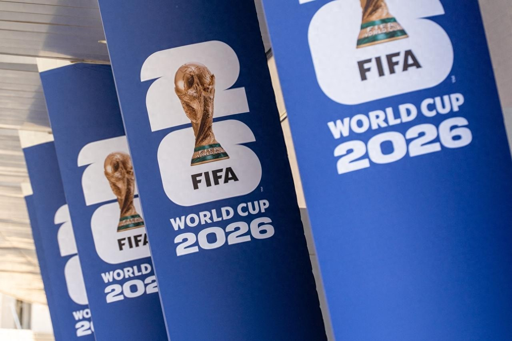
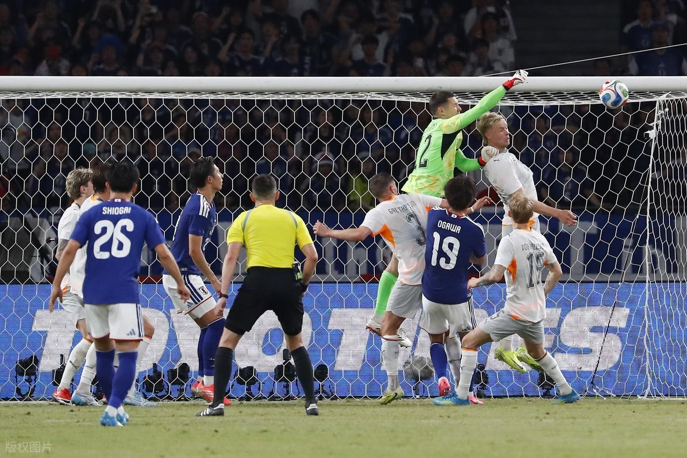
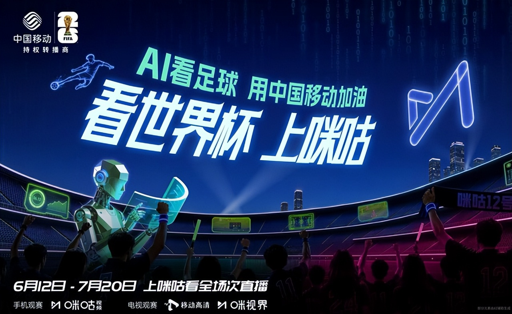

## 【转发】2026世界杯多项新规落地！巴西球星催生严规，日本队先尝到甜头

> **原文链接**：[2026世界杯多项新规落地！巴西球星催生严规，日本队先尝到甜头](https://www.toutiao.com/article/7647013581063045684/?log_from=dfaddc0a8fa22_1780467959740)
> **转发时间**：2026-06-03 14:34

> **原文标题**：2026世界杯多项新规落地！巴西球星催生严规，日本队先尝到甜头

2026美加墨世界杯开赛在即，本届赛事不仅迎来48支球队扩军的全新赛制，国际足联更是重磅推出多项赛场新规，从赛场行为规范、发球时限、换人流程到VAR判罚权限全面升级，力求改善传统赛场拖延、争议判罚、违规乱象，让比赛节奏更快、判罚更公正、对抗更纯粹，也让本届世界杯的每一场对决都充满全新看点，球迷观赛体验迎来全面革新。

本次世界杯落地四大核心新规，首先是

冲突捂嘴直接红牌

的严规。在过往赛场中，球员争执时捂嘴私语、规避镜头进行挑衅的行为屡见不鲜。在本赛季欧冠中，本菲卡球员普雷斯蒂亚尼就在冲突中捂着嘴对皇马球星维尼修斯进行种族歧视，被欧足联处以禁赛6场的处罚。在此事件后，FIFA出台新规明确，球员在赛场冲突中刻意捂嘴交流、隐藏言语，裁判可直接出示红牌。

球门球、界外球5秒快速发出

规则，彻底杜绝球队拖延战术。以往弱势球队常利用门将慢发球、拖延掷界外球消耗时间，保住平局战果。如今裁判会实施可视化实时倒计时，超时未发球将直接判罚球权转换或送给对手角球，有效提升比赛净时长和高强度攻防转换，比赛观赏性将大幅提升。

同时赛事新增

10秒快速离场换人规则

，被替换下场的球员必须快速离场，不能通过缓步离场、原地整理装备拖延时间的行为。新规在世界杯前的部分热身赛上已经试行，在5月31日日本1-0战胜冰岛的热身赛中，冰岛球员在被换下离场时用时超过10秒。根据新规则，准备替补上场的球员必须要等到1分钟后的下一次死球时才能上场，日本队正是抓住期间冰岛队少打一人的机会，打进了制胜进球，成为了新规的第一批受益者。

VAR介入范围的全面扩大

，VAR可在第二张黄牌明显错误或红牌给错人时介入核查，在角球中，错误判罚的角球也将由VAR介入核查，若角球或任意球开出前进攻方存在明显犯规，并直接影响进球、点球或纪律处罚，VAR同样可以介入。

多项新规落地后，可以预见的是，本届世界杯将告别慢节奏、拖延乱象，快节奏攻防、精准判罚、干净对抗成为新标签。强队的传控优势将进一步放大，弱队“摆烂偷分”的战术彻底失效，每一场小组赛、淘汰赛都悬念倍增，球迷再也不用忍受无聊的低端局，全程高能对决值得期待。

全新规则加持下的世界杯看点十足，无数球迷早已期待开启观赛体验，但想要沉浸式感受快节奏赛场对决，靠谱的观赛渠道至关重要。对于平时习惯在移动端看球的球迷而言，可能会想当然地认为高质量移动端的世界杯转播需要付费，于是转而选择免费盗播。然而市面上很多盗版链接画质模糊、卡顿严重，广告弹窗层出不穷，还存在隐私泄露风险，严重拉低观赛体验。

这次必须让更多球迷知道，看咪咕视频的世界杯转播不用花钱！而且，即使你不花钱，咪咕也想给你最好的！上咪咕看2026世界杯免费享超高清！作为本届世界杯官方合作观赛平台，咪咕视频全程覆盖104场赛事转播，揭幕战、小组赛、淘汰赛一网打尽，无需开通会员、无需付费充值，本届世界杯所有赛事均可免费观看，而且画质还是超高清，完美还原球员极速攻防、角球激烈争抢、精彩进球瞬间，让球迷不错过新规下的每一个赛场细节。

除了超高清免费直播，咪咕视频还配备专业解说团队，同时提供赛事回放、高光集锦、球队前瞻等专属内容，满足球迷全方位观赛需求。这个夏天，看世界杯上咪咕视频，零成本沉浸式畅享2026世界杯的极致精彩。
