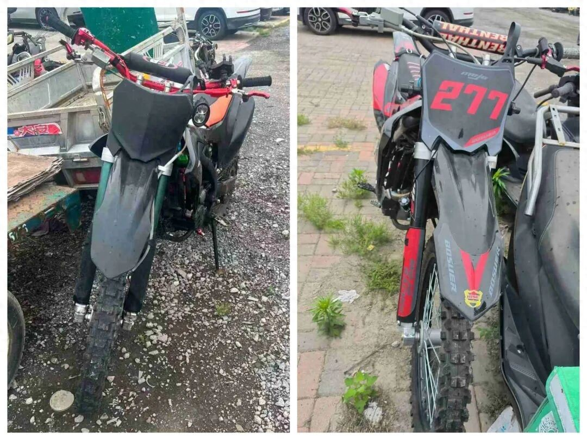
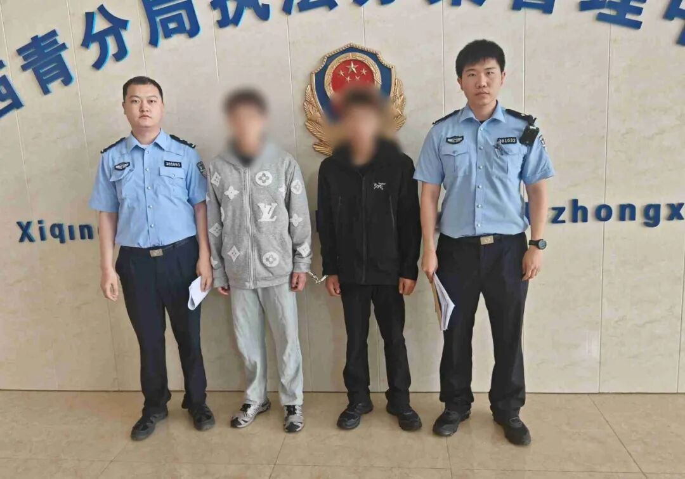
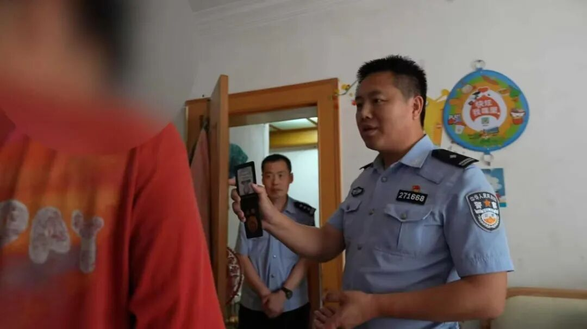
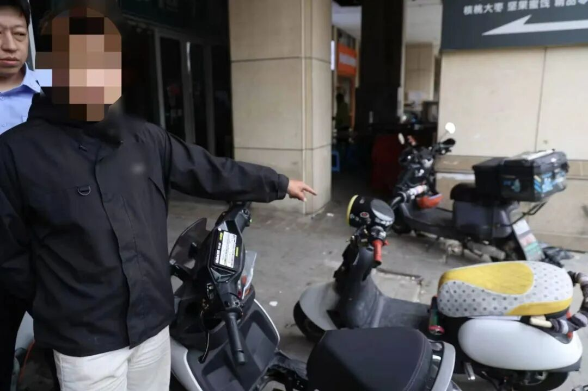
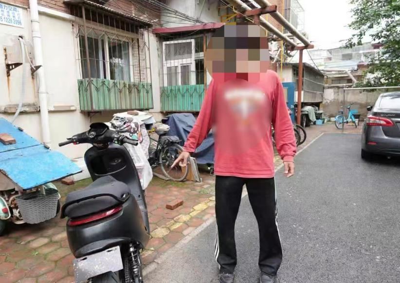

## 【转发】又有2人被拘！天津公安：发现一起，严查一起！

> **原文链接**：[又有2人被拘！天津公安：发现一起，严查一起！](https://www.toutiao.com/article/7645236719452684863/?log_from=c9b4c74b089cf8_1780471772961)
> **转发时间**：2026-06-03 15:32

> **原文标题**：又有2人被拘！天津公安：发现一起，严查一起！

深夜轰鸣、非法改装、“炫技”飙车

这些交通违法行为

害人害己

严重影响群众日常生活的同时

还严重威胁到其他交通参与者的生命安全

看似拉风的行为

实则危害无穷、法律后果严重！

对此，天津公安始终保持严打整治高压态势，持续开展治理“飙车炸街”专项行动，依法严厉整治车辆非法改装、追逐竞驶、翘头炫技等违法犯罪行为，发现一起、查处一起，绝不姑息！

近日，公安西青分局交管支队西青开发区大队在工作中获得线索：辖区某地有摩托车深夜“炸街”扰民，不时传来的轰鸣严重扰乱周边居民正常休息。

民警快速响应，联合分局信支支队、津门湖派出所，及时梳理涉案线索，开展调查走访，将涉嫌交通违法行为的焦某某、魏某某抓获，并查获涉事摩托车2辆。

经进一步核查发现，二人还存在以寻求刺激为目的，在驾驶摩托车期间站立“炫技”的行为。最终，二人因未取得驾驶证驾驶机动车、驾驶未悬挂机动车号牌的机动车上道路行驶、驾驶摩托车不戴安全头盔、扰乱公共场所秩序等多项违法行为，被公安机关依法行政拘留并处罚款，涉事车辆被依法扣押。

日前，公安河北分局鸿顺里派出所接到线索：有人深夜在河北区李公祠大街驾驶车辆“飙车炸街”。

接到线索后，民警立即展开调查。经缜密工作，5月26日，民警将嫌疑人孙某、李某传唤至公安机关接受调查。经查，二人驾驶电动车均经过违法改装，为追求新奇刺激，超速“飙车炫技”。目前，两人因扰乱公共秩序，已被公安机关依法予以行政处罚。

丨平安天津
