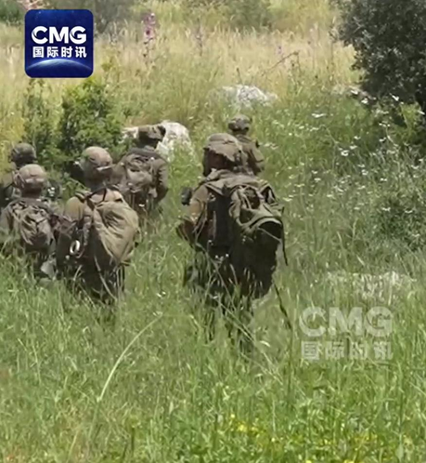
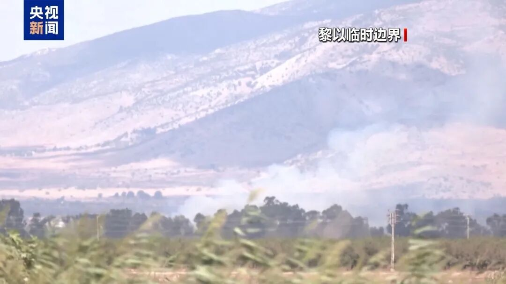
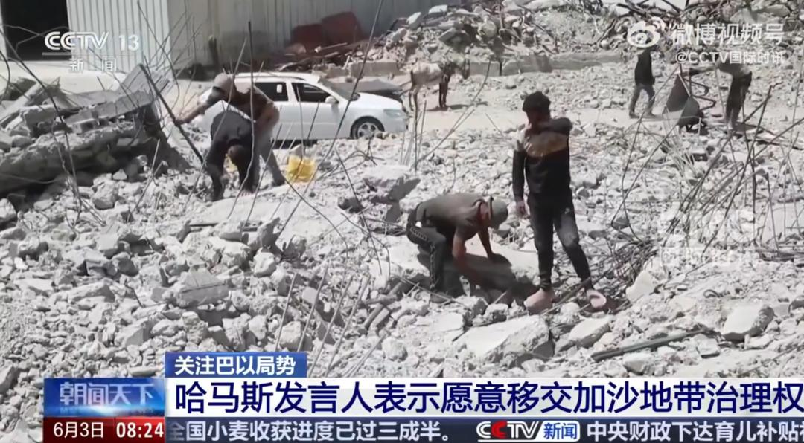
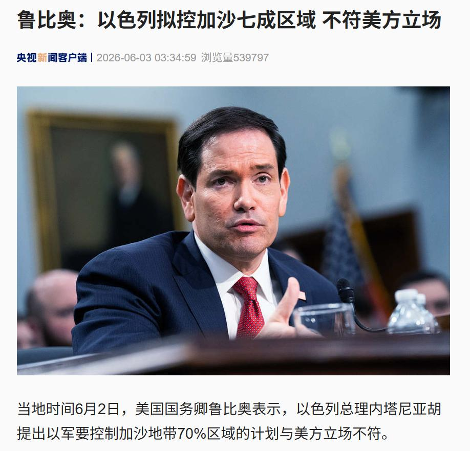

## 哈马斯宣布：愿移交加沙所有治理权！

> **原文链接**：[哈马斯宣布：愿移交加沙所有治理权！以军遭无人机袭击，多人受伤，真主党：不接受“部分停火”！遭特朗普怒斥“疯了”，以总理强硬表态](https://www.toutiao.com/article/7647022684865446440/?log_from=a0ae00607410e_1780472768464)
> **转发时间**：2026-06-03 15:48

> **原文标题**：哈马斯宣布：愿移交加沙所有治理权！以军遭无人机袭击，多人受伤，真主党：不接受“部分停火”！遭特朗普怒斥“疯了”，以总理强硬表态

以色列国防军6月2日晚间表示，当天早些时候，一架由黎巴嫩真主党发射的自杀式无人机在黎巴嫩南部造成以军4名士兵受伤，其中一名预备役士兵伤势为中度，另外三人受轻伤。

3天前，5月31日，以色列国防军发表声明说，一名21岁的士兵在黎巴嫩南部的战斗中身亡，另有4名士兵受伤。据以色列媒体5月25日报道，3月2日以黎战火重燃以来，20多名以军士兵死于作战行动，以军大部分人员伤亡由真主党无人机造成。

当地时间6月2日，以色列国防军表示，以军吉瓦提旅近日在黎巴嫩南部奈拜提耶地区开展多项军事行动，包括定点突袭、清除武器和打击武装人员。此次行动旨在在相关区域建立以军阵地，以消除对以色列北部的直接威胁，并加强在黎巴嫩南部的作战部署。

以军同时表示，以军部队已越过利塔尼河，在以色列空军支援下实施精确打击，摧毁武装组织基础设施，搜寻并清除武器，打死多名武装人员。

真主党：不接受与以色列“部分停火”

黎巴嫩真主党高级官员马哈茂德·库马提2日接受媒体采访时表示，真主党不同意与以色列达成任何“部分停火”协议。

库马提表示，真主党及其盟友不会接受“用以军停止袭击贝鲁特南郊换取真主党停止打击以色列北部居民点”的方案。他强调，真主党只接受全面、完整且真正的停火，而不是仅仅回到本轮冲突爆发之前的局面，“我们不会同意任何部分停火协议”。

据黎巴嫩方面2日消息，以色列军队当天仍持续对杜韦尔、奈拜提耶等黎南部多地发动空袭，造成至少12人死亡、4人受伤，死伤者包括黎政府军人员。

真主党当天说，其武装人员于2日凌晨对黎南部的以色列军队发动一系列袭击。

黎总统奥恩发表声明，强调黎方除了谈判之外别无选择。“真正的力量不在于发动战争，而在于有勇气和智慧通过谈判结束战争，以维护国家利益。”

黎卫生部当天发布的数据显示，自3月2日黎以战火重燃以来，以色列袭击黎巴嫩已造成3468人死亡、10577人受伤。

哈马斯：愿移交加沙所有治理权

鲁比奥：以方计划不符合美方立场

当地时间6月2日，巴勒斯坦伊斯兰抵抗运动（哈马斯）发言人哈齐姆·卡西姆在一份声明中表示，美国主导的所谓巴勒斯坦加沙地带“和平委员会”声称哈马斯不愿移交加沙地带治理权，不实且具有误导性，此类言论旨在为以色列在加沙地带的持续行动提供掩护。

哈齐姆·卡西姆称，哈马斯已做好充分准备，愿将加沙地带所有治理权移交给此前商定的巴勒斯坦技术官僚委员会，后者工作面临的阻碍主要来自以色列等方面。

当地时间6月2日，美国国务卿鲁比奥表示，以色列总理内塔尼亚胡提出以军要控制加沙地带70%区域的计划与美方立场不符。

鲁比奥当天下午在美国国会众议院拨款委员会举行的听证会上接受议员质询时说，内塔尼亚胡这一计划并非美国总统特朗普关于结束加沙冲突的“20点计划”组成部分。按照“20点计划”，以色列不需要那样做。

他同时称，美方目标和以方最终目标一致，即加沙地带由一个不是巴勒斯坦伊斯兰抵抗运动（哈马斯）的实体治理。

根据2025年10月生效的加沙停火第一阶段协议，以色列控制加沙地带53%的区域。今年5月17日，内塔尼亚胡称，以色列一直在扩大对加沙地带的控制范围，目前已控制加沙地带六成区域。

内塔尼亚胡同月28日表示，他已下令将控制范围扩大至约70%。哈马斯指责此举公然违反停火协议。

内塔尼亚胡：伊朗政权注定要消失

绝不允许伊朗威胁以色列生存

以色列总理内塔尼亚胡2日说，绝不允许伊朗威胁以色列的生存。

内塔尼亚胡当天在以色列情报和特勤局（摩萨德）新任局长交接仪式上说，以方将一如既往地奉行多年来的政策，绝不允许伊朗获得核武器、绝不允许伊朗威胁以色列的生存。内塔尼亚胡称伊朗政权是“注定要从世界上消失的恐怖政权”，以色列将“帮助实现这一目标”，使伊朗不会再用“核弹和数千枚致命的弹道导弹”威胁以色列。

据美国阿克西奥斯新闻网站1日报道，美国总统特朗普当天在与内塔尼亚胡的通话中，就以色列在黎巴嫩的军事升级行动爆粗口。报道援引两名消息人士的话称，特朗普在通话中称内塔尼亚胡“疯了”，并指责他忘恩负义，称自己曾帮助内塔尼亚胡在其腐败案审理中“免于入狱”。

以色列总理办公室一名工作人员2日则向以色列媒体否认内塔尼亚胡遭特朗普“辱骂”一事。以色列第12频道电视台当天援引这名工作人员的话报道说，内塔尼亚胡与特朗普就以色列计划袭击黎巴嫩首都贝鲁特的黎真主党目标进行了“紧张”的通话，但否认了特朗普在通话中辱骂内塔尼亚胡并对其进行人身攻击。

报道称，二人当天进行了两次通话，第二次通话气氛“更为紧张”，特朗普不满内塔尼亚胡暗示除推迟对贝鲁特的袭击外，战争仍在全面继续；而内塔尼亚胡则对特朗普在社交媒体平台发文暗示以色列已在所有战线上停火“感到沮丧”。双方谈话最终达成共识，即只要以色列领土不遭到攻击，以色列将不会对贝鲁特发动袭击。

编辑|段炼 杜波

校对|梁露月

每日经济新闻综合自央视新闻、新华社

每日经济新闻

**转发备注**：这是我的备注，不知道写啥 些