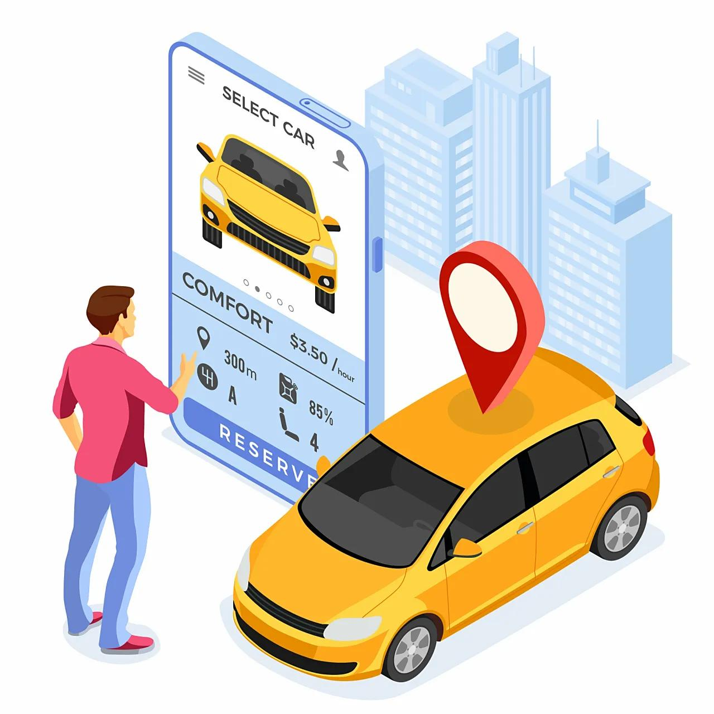
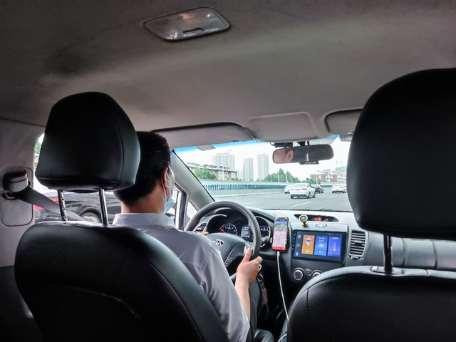
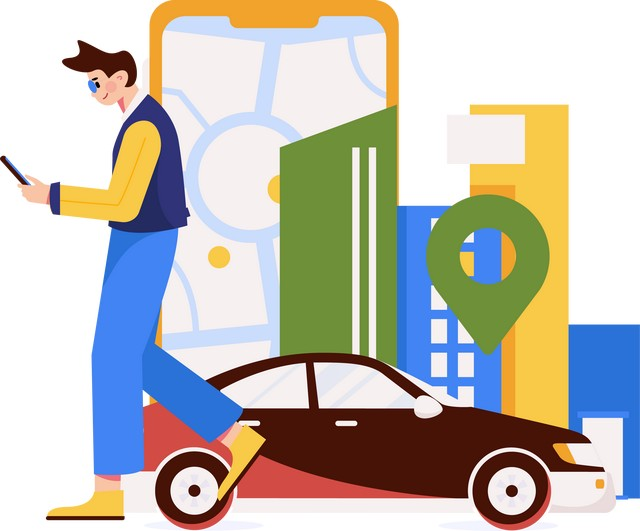

## 【转发】租车跑还是买车跑？一个干了4年的师傅算了一笔账，结果扎心了

> **原文链接**：[租车跑还是买车跑？一个干了4年的师傅算了一笔账，结果扎心了](https://www.toutiao.com/article/7639761726052811298/?log_from=17ead5f144fc88_1780566569427)
> **转发时间**：2026-06-05 01:12

> **原文标题**：租车跑还是买车跑？一个干了4年的师傅算了一笔账，结果扎心了

老赵蹲在马路牙子上，面前停着两辆车。左边那辆是他租的，每个月要交四千八的租金，明天就是还车日；右边那辆是他准备买的二手车，标价六万八，车商拍着胸脯说这车跑网约车绝对划算。他在这两辆车之间来回看了十几遍，手机里的计算器摁得快要冒烟。

选租车还是买车？这几乎是每一个准备跑网约车的人都会遇到的灵魂拷问。老赵已经在这个行当里泡了四年，两种模式他都试过，踩过的坑比大多数人都多。今天就把这笔账彻底算清楚，顺便把那些没人告诉你的门道，全部抖出来。

老赵的第一年：租车跑，感觉像给租车公司打工

四年前，老赵刚入行，啥也不懂。听人说跑网约车赚钱，兴冲冲地找了家租赁公司，签了合同租了一辆电车。租金每月四千五，押金一万。新车，续航四百公里，车况确实不错。

头三个月新手保护期，老赵跑得还挺开心。一个月流水一万六七，扣掉租金和电费，到手还能剩个万把块。他觉得这买卖能干，每天起早贪黑，干劲十足。

可是跑到第六个月，老赵发现不对劲了。

首先是流水慢慢往下掉。新手保护期过了，平台不给倾斜了，单量明显变少。为了保持收入，老赵只能延长在线时间。以前一天跑十个小时，后来变成十二个小时，再后来十四个小时。人累得跟狗一样，流水却回不到从前。

其次是每个月的固定支出让他喘不过气。租金四千五雷打不动，电费一千五左右，再加上平台扣的各种费用、停车费、偶尔的违章，一个月固定支出就要七千往上。这意味着他每个月的流水要做到一万五以上，才能到手八千。而跑到一万五的流水，意味着每天在线至少十二个小时，一个月休息不超过四天。

老赵咬着牙干满了一年。年底算总账，一年流水十八万多一点，减去租金五万四，电费一万八，再加上保险（租车公司只含交强险，他自己补了商业险）、停车、违章、维修（有一次轮胎扎了换了两条，花了一千二），到手一共八万出头。平均每个月六千七。

六千七一个月，每天干十二个小时以上，没有五险一金，没有任何福利。老赵那一年老得特别快，三十出头的人，看着像四十多。

更要命的是还车的时候。租赁公司检查车，说他右后门有一道划痕、前保险杠有石子崩的小坑、内饰座椅有污渍、四个轮毂有磨损，林林总总扣了三千八。一万押金拿回来六千二。老赵看着那六千二，心里在滴血。那道划痕他都不知道什么时候有的，污渍是乘客留下的，但合同上写得很清楚：还车时车辆如有任何损伤，由承租人承担。

老赵后来才明白，租车跑网约车，本质上是在给租赁公司打工。你每天辛辛苦苦跑的钱，一大半交了租金，一小半交了电费，剩下一点点是自己的。而且你没有任何资产留下来，车是人家的，你还回去了啥也没有。跑一年，除了落下一身病，啥也没攒下。

老赵的第三年：买车跑，以为翻身了，结果又掉进另一个坑

租车跑了一年，老赵觉得不甘心。他算了一下，如果自己买一辆车，省掉每月四千五的租金，一年就能多赚五万多。这账谁不会算？老赵咬咬牙，把积蓄掏出来，又跟亲戚借了点，买了一辆十四万的电车。

买车那天，老赵摸着方向盘，觉得自己终于翻身了。再也不用每个月交那该死的租金了，再也不用担心还车时被扣钱了，这车是自己的，跑多少都是自己的。

刚开始确实爽。没了租金压力，老赵每个月的固定支出只有电费、保险和保养。保险一年九千多（营运险），平均每月八百；电费一千五；保养平均每月两百。固定支出两千五左右，比租车时少了整整两千块。老赵第一个月到手收入直接破万，开心得请老婆吃了顿火锅。

可是跑着跑着，老赵发现事情没那么简单。

首先是车辆折旧，这笔账他买车的时候没认真算。新车十四万落地，开了两年，跑了十五万公里，去二手车市场一问，收车价不到七万。两年折旧七万，平均每个月将近三千块。老赵傻眼了，他每个月到手的收入减去折旧，跟租车时差不多，甚至还不如。

其次是车辆维修的成本开始冒头。新车头一年没啥问题，第二年就开始有毛病了。空调压缩机坏了一次，修了两千二；减震器漏油，换了一对花了一千六；到了第三年，电池续航从四百掉到了三百出头，虽然还在质保期内，但衰减到这个程度，跑网约车已经有点吃力了，以前一天充一次电就够了，现在中途得补一次，浪费时间不说，充电费也涨了。

更要命的是，老赵出了一个小事故，追尾了前车，自己的车头受损。修车花了一万二，保险赔了大部分，但第二年保费直接涨了两千多。而且修车那一个星期跑不了车，一分钱收入没有，还得继续还车贷——对，老赵买车的时候贷了八万，每个月还三千。

老赵又干了一年多，实在扛不住了。第三年年底，他把车卖了，卖了六万五。算了一下总账：买车花了十四万，加上利息、保险、保养、充电、维修、违章，三年总投入大概二十四万。三年跑下来的流水一共四十七万。减去投入，到手二十三万。平均每个月六千四。

跟租车的时候差不多，甚至还少了一点。但别忘了，他买车的时候投进去了十四万本金，这笔钱如果存银行或者做别的，多少有点利息。而且他付出了更多的精力——自己的车，有点小剐小蹭心疼得要命，保养也更上心，心理负担比租车重多了。

老赵把车卖掉那天，坐在空荡荡的车位上抽了半包烟。他以为买车是出路，没想到是另一个坑。

那到底租车好还是买车好？老赵的真心话

跑了四年，两种模式都试过，老赵现在可以负责任地说一句：都不好。

如果非要选一个相对不那么坑的，老赵的答案是——看你的情况。

什么情况下租车更合适？

第一，新手试水。从来没跑过网约车，不知道这行水多深，想试试自己能不能扛住。这种情况千万别一上来就买车，先去租一辆，短租三个月。三个月后算算账，看看自己到手多少钱，身体吃不吃得消。觉得能干再考虑长期的事，干不了把车还了，损失有限。老赵见过太多一上来就贷款买车的新手，跑了一个月后悔了，车卖不掉，贷款还要还，那才叫生不如死。

第二，短期过渡。比如辞职了暂时找不到工作，或者想利用几个月时间赚点快钱。这种情况租车灵活，说走就走，说停就停。买车的话，买进卖出折腾不说，万一跑两个月不想跑了，卖车亏的钱可能比租金还多。

什么情况下买车更合适？

第一，确定要长期跑，而且能吃苦。如果你打定主意要跑两三年以上，家里又有地方充电（有自己的充电桩，电费便宜很多），那买车确实比租车划算。但前提是——买便宜的车，别买贵的。老赵后来反思，他买十四万的车太贵了。如果买一辆七八万的电车，甚至五六万的二手电车，折旧压力小很多，回本也快。很多老司机专门买那种两三年车龄的二手电车，价格打对折，拿来跑网约车，跑两年再卖掉，亏不了多少。

第二，能接受自己修车、自己处理各种麻烦。租车的好处是车有问题找租赁公司，虽然他们有时候也扯皮，但至少有个地方找。自己买车，爆胎了自己换，坏了自己修，撞了自己处理保险，所有事情都得自己扛。如果你是那种怕麻烦的人，买车会让你头大。

但老赵要说的真心话是：不管是租车还是买车，现在这个行情，全职跑网约车都很难赚到钱了。司机太多，平台太精，成本太高。租车是给租赁公司和平台打工，买车是给自己买了一份时薪不到二十块的工作，还要搭上一辆车。

有人靠跑网约车赚到钱了吗？有，但只有三种人

老赵跑了四年，见过形形色色的司机。真正赚到钱的，只有下面这三种。

第一种是跑专车或者豪华车的。这些人开的是二三十万以上的车，接的是高客单价的单子，乘客素质相对高，平台抽成比例相对低。但门槛也高，车要好，人要精神，服务要到位。而且专车单量本来就少，不是每个城市都有市场。

第二种是自己有充电桩、买便宜电车、一天跑十五六个小时的狠人。这类人把成本压到了最低，把时间拉到了最长，用体力换钱。但老赵认识几个这样的人，没有一个身体是好的。三十多岁腰椎间盘突出的大把，四十出头冠心病、高血压的也不少见。赚的钱，迟早要还给医院。

第三种是那种不靠跑车为主要收入的人。比如家里有辆闲着的电车，晚上周末出来跑跑顺风车或者高峰期单子，赚个烟钱油钱。这种人心态好，不靠这个吃饭，反而跑得轻松，偶尔还能赚到钱。但这不叫“全职跑网约车”，这叫“兼职贴补家用”。

除了这三种，普通人全职跑网约车，租车也好买车也好，最后的归宿基本都是——带着一身病和一本糊涂账离开这个行业。

最后的大实话

老赵现在不跑网约车了。他去了一家物流公司开货车，一个月固定工资七千五，有五险一金，每天工作九个小时，虽然也累，但至少不用每天睁眼就想今天要跑多少流水才够本。

有人问他，如果再选一次，租车还是买车？老赵说，他会选第三条路——不跑。

但如果实在没有别的选择，非跑不可，老赵的建议是：先租车跑三个月，三个月后如果还想干，去买一辆便宜的二手的电车，别贷款，别买新车，别买贵的。然后给自己定一个目标——最多干两年，攒够一笔钱就撤。千万别像他一样，一跑就是四年，回头一看，除了开了一辆快散架的车，啥也没剩下。

屏幕前的朋友，你是租车跑还是买车跑的？或者你正在纠结选哪个？欢迎在评论区说说你的情况，或者算算你的真实收入。咱们一起交流，看看有没有更好的路。说不定你的经历，就能帮一个正准备入坑的朋友少走两年弯路。评论区见。

