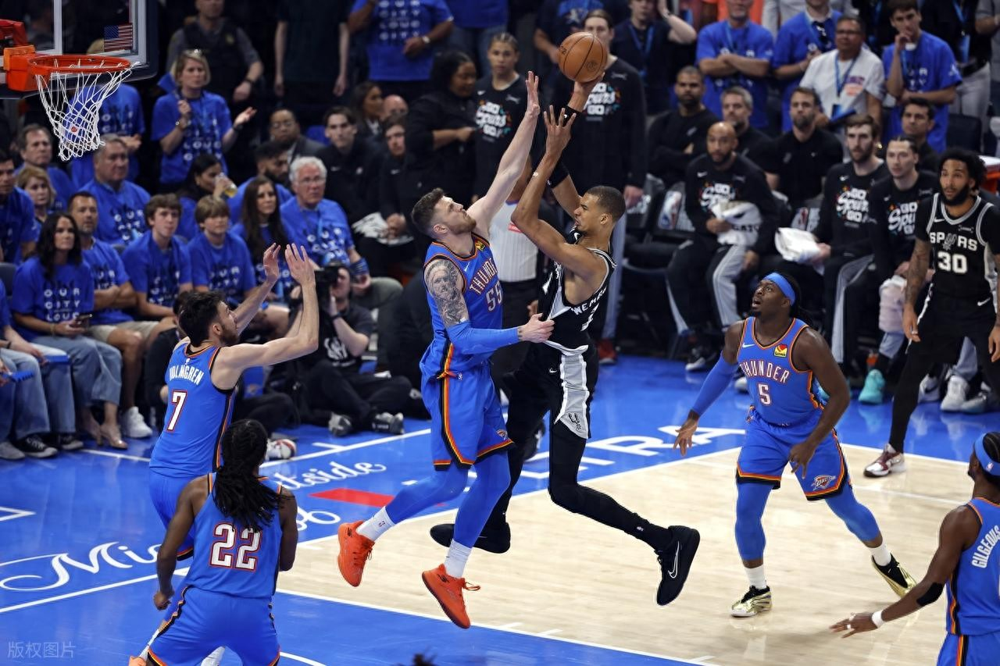
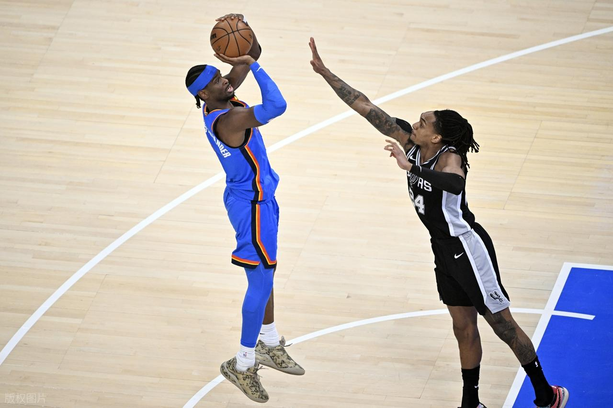
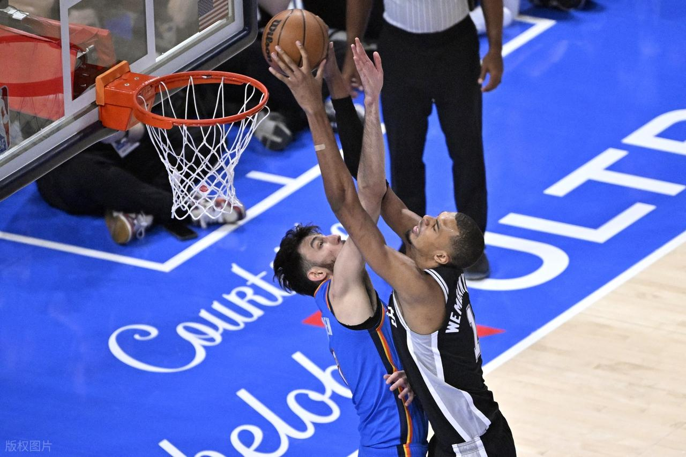

> **原文链接**：[12年后再进总决赛！文班亚马获西决MVP 马刺4-3雷霆将同尼克斯争冠](https://www.toutiao.com/article/7645874968391123492/?app=news_article)
> **转发时间**：2026-05-31 17:05

北京时间5月31日，NBA季后赛西部决赛G7，马刺客场以111-103力克雷霆，也以4-3的总比分淘汰对手闯入到总决赛，文班亚马以出色的表现荣膺西决MVP。马刺上一次闯入总决赛，还要追溯到2013-14赛季，当时球队以4-1战胜热火夺得冠军。经过12年的等待，马刺终于再次进军总决赛，将同尼克斯争夺总冠军。

雷霆队亚历山大35分9助攻3抢断、华莱士17分7篮板4助攻、卡鲁索12分5篮板4助攻、麦凯恩12分、杰林-威廉姆斯11分10篮板4助攻；马刺队文班亚马22分7篮板、尚帕尼20分6篮板、卡斯尔16分6篮板6助攻、福克斯15分5助攻3抢断、哈珀12分7篮板、瓦塞尔11分6篮板、凯尔登11分。

首节比赛，文班亚马篮下进攻打成，瓦塞尔和卡斯尔联袂抢分，文班亚马又送上霸气十足的隔扣，福克斯和尚帕尼连进三分，卡斯尔送上补扣，助马刺以18-8取得出色开局。瓦塞尔的远投又进，卡斯尔打成2+1，尚帕尼的底角三分也命中，马刺以27-13继续拉大分差。麦凯恩里突外投连连打成，肯威篮下强打得手，麦凯恩也命中三分，助雷霆将场上比分迫近。该节战罢，马刺以32-25领先。

次节比赛，哈珀远投命中，福克斯篮下抛投打进，文班亚马又在外线开火，布莱恩特的突破也展现威力，助马刺以44-33又取得11分的优势。亚历山大展现出色个人能力连得7分，杰林威篮下抛投打进，亚历山大又不断利用中投抢分，多特在弧顶位置远投命中，雷霆在场上穷追猛打，将场上比分追成49平。杰林威的跳投，助雷霆反超比分；福克斯远投命中，凯尔登篮下二次进攻打成，瓦塞尔的中投得手，助马刺重新夺回优势，以56-53领先结束半场。

第三节比赛，双方开局成功呈现胶着态势，双方在场上打成63平。尚帕尼外线开火相继命中两记三分，文班亚马又远投命中，马刺以76-65又拉开比分。雷霆在运动战得分方陷入到停滞，凭借着罚球连得9分，杰林威的远投又进打破球队的运动战分荒，助雷霆将场上比分再度追近。该节战罢，马刺以80-77领先。

末节比赛，凯尔登外线连进两记三分，福克斯和文班亚马又连进三分，凯尔登的突破又进，马刺以97-86再度拉开比分。亚历山大站出连得5分，助雷霆将比分追成91-97。卡斯尔的跳投打进，尚帕尼远投得手，哈珀里突外投两轮打成，助马刺以107-95仍然保持着优势。华莱士关键时刻一己之力连得8分，助雷霆保持住了比赛的悬念。关键时刻，瓦塞尔扣篮，马刺以111-103领先，彻底终结悬念，最终马刺如愿胜出闯入总决赛。

首发阵容

雷霆：多特、霍姆格伦、哈尔滕施泰因、华莱士、亚历山大

马刺：瓦塞尔、尚帕尼、文班亚马、卡斯尔、福克斯
